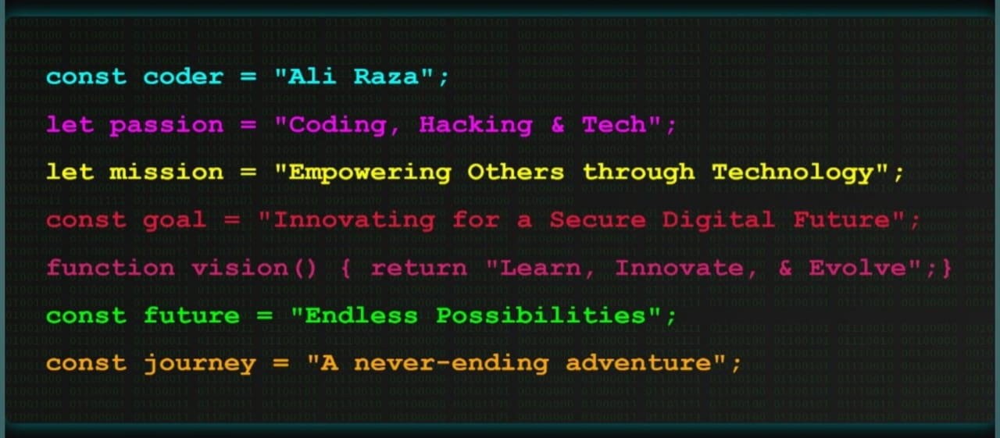

# Hey 👋 I'm Ali Raza

  

## 🚀 About Me

I'm a passionate **Software Engineering student** with a non-traditional background, focused on **building real systems**, not just learning syntax. I'm dedicated to creating **secure, scalable applications** that solve real-world problems.

### 🎯 Core Values
| Value | Description |
|-------|-------------|
| **Practice First** | Practical projects > theory |
| **Open Source** | Free & open tools > paid shortcuts |
| **Security Focused** | Learn how systems **fail**, not just how they work |
| **Scalable Thinking** | Build things that can **grow into real products** |

I work across **frontend, backend, and databases**, while strengthening my foundation in **Java (OOP)**, **C++**, and **system design**. My long-term direction is building **secure, scalable web applications**, SaaS tools, and developer-focused platforms.

## 🎯 Current Focus

- 🌐 Building **full-stack web apps** with authentication, roles & real data flow
- 🔐 Strengthening **Java OOP & C++ fundamentals** (academics + system thinking)
- 🔒 Learning **backend security concepts** (auth flows, access control, data safety)
- 📈 Designing projects with **real-world scalability in mind**

## 💻 Tech Stack (What I Actually Use)

### 🧩 Programming Languages

###  Frontend

### ⚙️ Backend

### 🗄️ Databases & Caching

### ☁️ BaaS & Platforms

### 🛠️ Tools & Workflow

## 📊 GitHub Stats

 

## 🏆 GitHub Trophies

## 🌐 Connect With Me

## 💡 Featured Projects

<!-- Add your projects here -->
| Project Name | Description | Technologies | Demo |
|--------------|-------------|--------------|------|
| Project 1 | Full-stack web application with authentication | React, Node.js, MongoDB | [Live Demo](#) |
| Project 2 | Secure API with role-based access control | Express, JWT, PostgreSQL | [Live Demo](#) |
| Project 3 | Real-time chat application | Socket.io, React, Redis | [Live Demo](#) |

## 🌟 Fun Facts

- 📚 Currently reading: "Clean Code" by Robert C. Martin
- 💬 Ask me about: Backend architecture, Security best practices, or Open Source
- 🎯 2024 Goal: Contribute to more open-source projects
- ⚡ Fun fact: I believe the best way to learn is by building real products

## 📜 Philosophy

> *"Learn deeply. Build honestly. Secure what you create."*

### 🔥 Visitor Count

---

  

